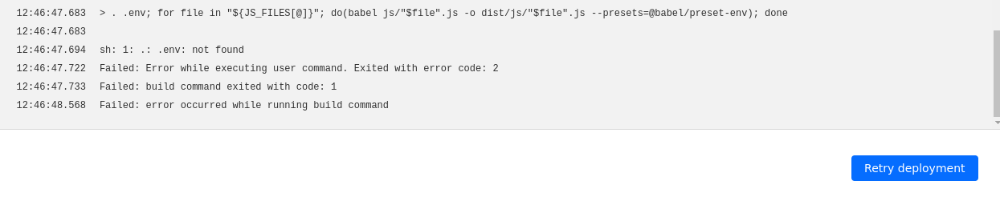
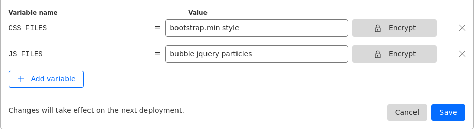
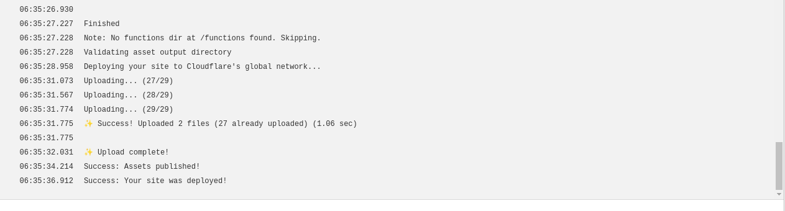

## Problem

- When deploying a static site with NPM scripts that utilize bash commands and environment variables file inside `package.json` scripts, you might define something like:

```
  "scripts": {
    "transpile-js": ". .env; for file in "\${JS_FILES[@]}"; do(babel js/"\$file".js -o dist/js/"\$file".js --presets=@babel/preset-env); done"
  }
```

However, when deploying with Cloudflare Pages, this approach can lead to errors such as:



## Solution

- Set the environment variables in the Cloudflare Pages dashboard.
  

- Use dotenvx to preload environment variables instead of using the .env file, as Cloudflare doesn't support .env files.

  ```
  "scripts": {
    "transpile-js": "dotenvx run -- bash -c 'read -r -a JS_FILES <<< "$JS_FILES"; for file in "${JS_FILES[@]}"; do(babel js/$file.js -o dist/js/$file.js --presets=@babel/preset-env); done'"
  }
  ```

## Result

- The error is gone and the deployment is successful.
  
